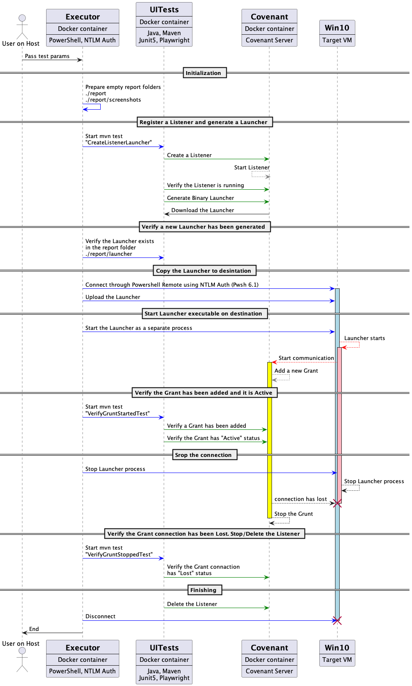

# Covenant Grunt Connection Test
Challenge solution

## Description

This project tests the Covenant's Grunt connection.

#### Environment

* **Covenant Server** - a separate Docker container
* **Test Runner** - a separate Docker container
* **Web UI executor** - a separate Docker container
* **Win 10 destination** - accessible in the network
* **Host** - any OS containing a Docker

#### Tech stack
* **Docker** - 3 instances
* **Java, Maven, Junit 5, Playwright** - UI web

#### Covenant

Project interactions with the Covenant using the Web UI interface:
* Creates a Listener
* Generates and downloads Launcher with a random name
* Verifies a Grant has been added and it is Active after the launcher is executed on the destination
* Verifies a Grant connection has been stopped and it has Lost 
status after the launcher is stopped on the destination
* Deletes the Listener at the end, so it is safe to run the tests many times.


#### Win 10

Project interactions with the Windows 10 using PowerShell Remote:
* Connects to the Win 10 using provided credentials
* Holds the connection
* Copies the Launcher to the %TPM% directory
* Starts the Launcher
* Stops the Launcher
* Disconnects from the Win 10 


#### Main point of the solution
The main point of the solution is the leveraging PowerShell's NTLM auth connection mechanism for working with the destination Wind 10 machine, copying the launcher on it, starting and stopping the launcher executable.


#### About the project

* This project is modular, which means
    * the Covenant server's interaction through UI can be replaced by API without, braking the flow.
    * Playwright Java can be replaced by any Web page testing tool like Selenium or Cypress.io and language, braking the flow.
    * Interaction with the destination OS Windows 10 can be replaced by ssh connection and Expect command, without braking the flow
* The project requires to have only Docker installed on the Host machine.
* The Destination Windows 10 OS can be anywhere accessible through the network.
* Project inputs are configurable, the default file is `./config/config.json`
* Project inputs can be passed as CLI arguments, which are privileged then from config files.
* The Project is modular and the user may controls which module to run, on which module to stop, or which modules to run - through `-Lifecycle` parameter.
* Many screenshots are collected during Wbe UI testing. Reports are by default in `./report` folder.
* The project is safe to run more than once.

Please look at Sequential diagram in the end of the Readme.

---

# Setup

* Build Powershell image
```powershell
docker build --pull --rm -f "./docker/Dockerfile-pwsh" -t covenant-pwsh-java:v1 .
```

* Build Playwright image
```powershell
docker build --pull --rm -f "./docker/Dockerfile-playwright" -t covenant-pw-java:v1 .
```
* Disable "Run-time Protection" on Windows 10
* Be sure the Powershell Remote is enable on Windows 10 (it is enabled by default)

---

# Execution

go to the project folder and run the command below
```powershell
docker run --rm -it -v /var/run/docker.sock:/var/run/docker.sock -e PROJECT_ROOT=`pwd` -v `pwd`:/runner covenant-pwsh-java:v1 ./TestRunner.ps1
```

The console will report the output.

---

# Sequence Diagram
Please read the sequential diagram for understanding how the project works and what it does.
